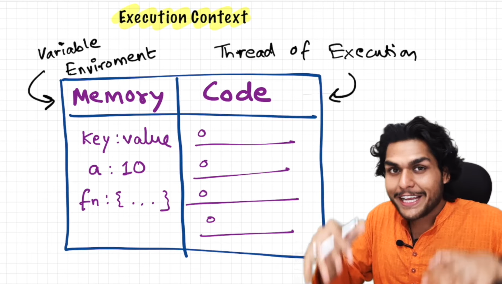

### Episode 01

# How JavaScript works & Execution context

> ## _"Everything in JavaScript happens inside an **Execution Context**"_

### Execution Context = container

- It contains 2 components :
  1. **Memory** Component
  2. **Code** Component

### 1. Memory Component

- Also known as **Variable Environment**
- stored **variables & functions** in the form of key-value pairs.
- for example:
  ```js
    key : value
    a : 10
    function : {}
  ```

### 2. Code Component

- Also known as **Thread of Execution**
- here code executed one line at a time
- for example:
  ```js
  1. let a = 10;
  2. let b = 20;
  3. let sum = a + b;
  4. console.log(sum);
  ```
  - in above example, line 1 execute first then 2, then 3, and at last line 4 execute

> ## _"JavaScript is a synchronous single-threaded language"_

- **single threaded** = JS can only execute one command at a time in a specific order
- means it can go next line once the current line has been finished executing

<hr>
<details>
  <summary>Image to help you visualize</summary>
  


</details>
