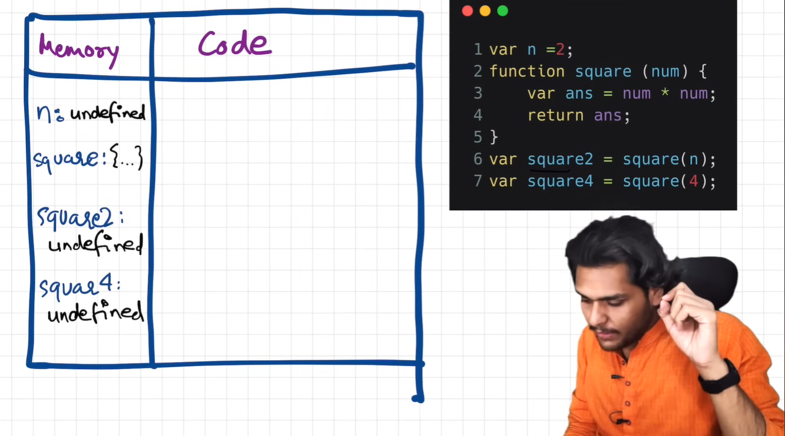
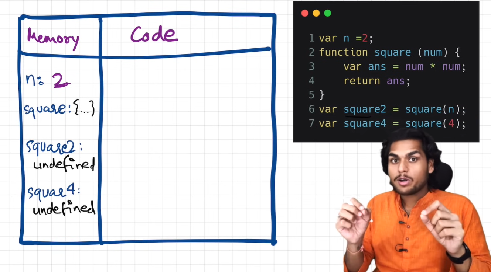
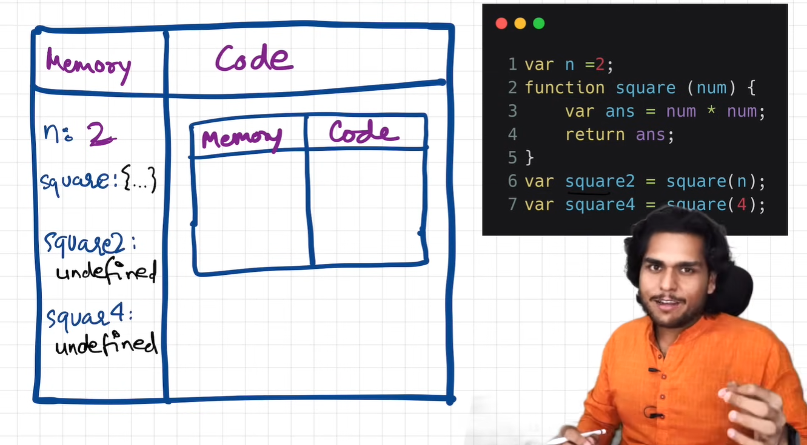
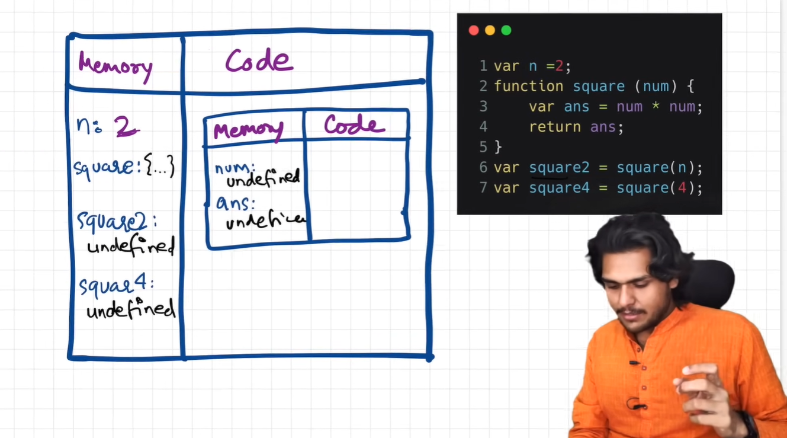
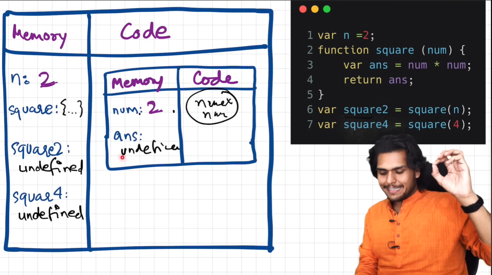
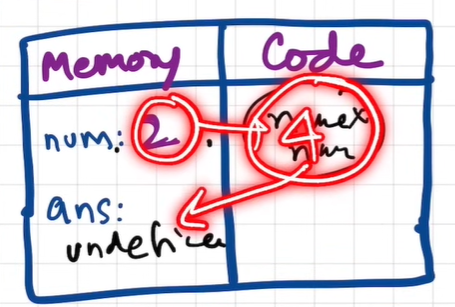
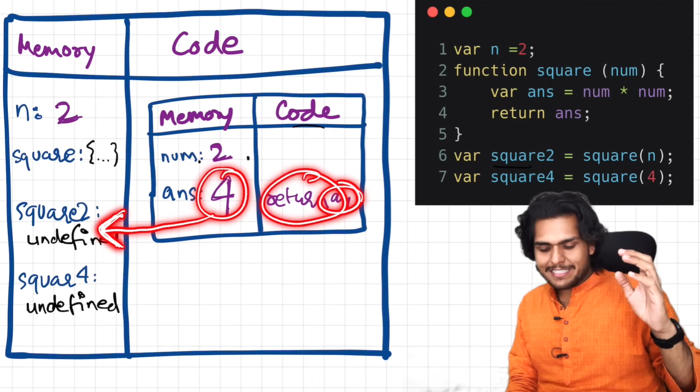
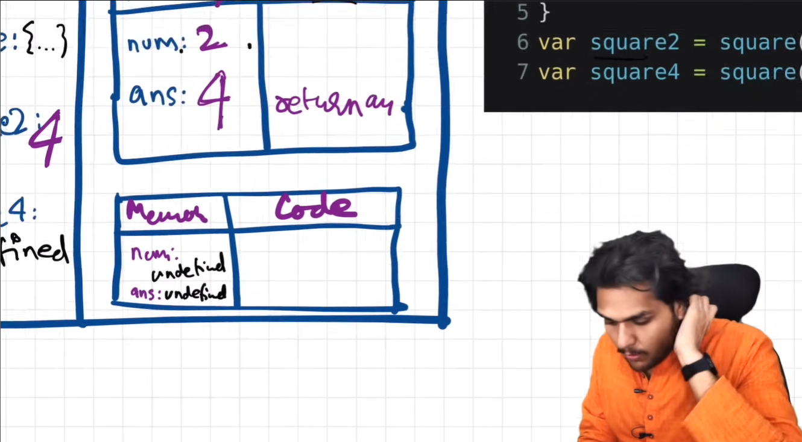
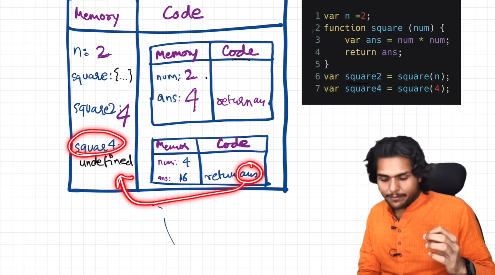
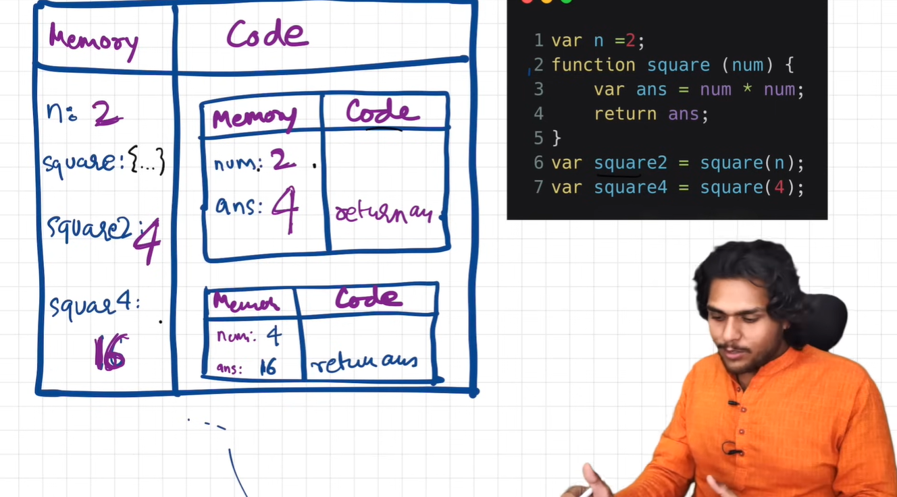

### Episode 02

# How JavaScript Code is executed? & Call Stack

### What happens when you run JavaScript code ?

**Remember**

> ### _"Everything in JavaScript happens inside an **Execution Context**"_

- When a code starts running, a Global Execution Context created.
- This Execution Context created in 2 phases :
  1. Memory Creation Phase
  1. Code Execution Phase

#### Suppose you have this code

```js
1.    var n = 2;
2.    function square(num) {
3.      var ans = num * num;
4.      return ans;
5.    }
6.    var square2 = square(n);
7.    var square4 = square(4);
```

#### JavaScript Engine execute code in 2 phases

    1. Memory Creation Phase
    2. Code Execution Phase

1. ### Memory Creation Phase

- In the first phase (Memory Creation)

- JavaScript skims thorugh all the code that you have written & allocate memory to all the variables & functions.

- variables store **undefined**, and functions store **literally the whole code.**

  - **undefined** = special keyword in JavaScript.

  

- here you can see :
  - variable n, square2, square4 stored undefined
  - and function **square** stored the whole code inside that function
  - i.e
    ```js
    {
      var ans = num * num;
      return ans;
    }
    ```

2. ### Code Execution Phase

- JavaScript once again runs through this (above) whole JS code & it execute the code now
- this is the phase in which when all these functions & every calculation in the program is done.
- In line 1

  - till now `n = undefined`, but now it is updated to `n = 2`(see code)

    

- In line 2-5

  - there's nothing to execute literally

- In line 6

  - most amazing part - here we invoking a function
  - function invokation = function name with this ()
    - . i.e `square(n)`
    - it means the function is now being executed
  - **function:**
  - functions are the heart of the JS
  - they behave differently in JS than any other language
  - whenever a new function is invoke

    - a brand new Execution Context created for that function.
    - again this new Execution Context has 2 component

      - **(Memory & Code)**

        

      - now we are concerned about this code :

        ```js
          2.  function square (num) {
          3.    var ans = num * num;
          4.    return ans;
          5.  }
        ```

            - (num) in line 2 is a parameter of function square
            - (n) in line 6 (see initial top code) is a argument of square(n)

      - In phase 1 (i.e Memory Creation)

        - variables `num = undefined` & `ans = undefined`

          

      - In phase 2 (i.e Code Execution)

        - in this we will execute each line
        - in line 2
          
        - in line 3  
          

        - in line 4

          - `return ans;` will return the `ans = 4` to that function which is in line 6 i.e `square(n)`

            

          - now `square2 = undefined` replaced with `square2 = 4`
          - now this function is done executed, so this Execution Context is deleted from Global Execution Context

- In line 7

  - same as line 6
  - but the argumant here is 4 (i.e `square(4)`) instead of `square(n)` (i.e square(2))

    

    

  - after done executing this Execution Context will also be deleted from the Global Execution Context

- so line 7 executed and there is nothing after that
  - so JS done all his work, now the program is finished
- finally the Global Execution Context done executing

    

- now the whole Global Execution Context will be deleted.

### Don't you think this that all this too much to manage for JS engine

- means Execution Context one by one , inside one, all this thing tough to manage
- imagine if there was a function invokation inside the function, so you would have created an nested Execution Context.
- So it is very difficult for JS engine to manage & it does it very beautifully

- it handles everything to manage this Execution Context creation, deletion and the control, JS manages a STACK.
- this is known as **Call Stack**

### Call Stack

- Call Stack is like a Stack.
- in bottom of the Call Stack we have our the whole Global Execution Context
- and whenever the new Execution Context is created, that EC put inside the stack above the GEC and so on..
- when one EC done executing it gets popped out from the Call Stack and so on
- finally the control goes back to GEC, and then GEC popped out the stack
- and we are done with our JS program

**another core concept :**

> ### _"Call stack maintains the order of execution of execution contexts"_

### Call Stack also knows as :

1. Execution Context Stack
2. Program Stack
3. Control Stack
4. Runtime Stack
5. Machine Stack
