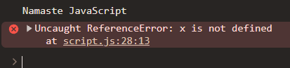

### Episode 03

# Hoisting in JavaScript

suppose we have this code :

```js
var x = 7;

function getName() {
  console.log("Namaste JavaScript");
}

getName(); // invoking a fn
console.log(x);
```

output would be :

```js
Namaste JavaScript
7
```

the output doesn't seem weird here.

Now, see this code

```js
getName(); // invoking a fn before initializing the fn
console.log(x); // logging the value of x before creating it

var x = 7;

function getName() {
 console.log("Namaste JavaScript");
}
```

here you can see,

- we are calling (invoking) `getName` function before initializing it,
- same with variable x we are trying to access the value of x before creating it.

**So now What do you expect to see here as output ??**

In other programming languages, this will result out to be error & you cannot access variables before initializing it. 

But **JavaScript** is very different in this case.

and the output of the above code :

```js
Namaste JavaScript
undefined
```

what is **undefined** here ??

- It representing the value of `x`
- as we try to access it before creating variable x.
  - i.e `var x = 7;`.

let's remove the `var x = 7;` from the code and see the output

```js
getName(); // invoking a fn before initializing the fn
console.log(x); // logging the value of x which is not created

function getName() {
 console.log("Namaste JavaScript");
}
```

the output would be:

```js
Namaste JavaScript
Uncaught ReferenceError: x is not defined
```

<details>
  <summary>Click to see how the output will look like in the browser console</summary>
  
</details>

#### now what is **not defined** here

Is **_not defined_** and **undefined** are same ?

- **NO**, its not the same

> This all interesting thing is know as "HOISTING" in JS ✨

## Hoisting

- Hoisting is a phenomenon in JS
- by which you can access variables & functions even before you have initialize it or put some value in it.
- you can access it without an error.
- So wherever this `var x = 7` is there in the program it doesn't matter & you can acccess it anywhere in the program

Now let's see this code

```js
var x = 7;

function getName() {
  console.log("Namaste JavaScript");
}

console.log(getName); // accessing getName fn after initializing
```

output would be:

```
ƒ getName() {
  console.log("Namaste JavaScript");
}
```

now, see this code

```js
console.log(getName); // accessing getName fn before initializing

var x = 7;

function getName() {
  console.log("Namaste JavaScript");
}
```

output would be same as above, see here:

```
ƒ getName() {
  console.log("Namaste JavaScript");
}
```

huh... this look weird....

### In terms of variables

- if we try to access it before creating it we see **undefined** as output.
- And if we try to access variable without creating it anywhere in the code, we see **not defined** as output

### But in terms of Functions

- whether we try to access it before or after initializing it we see the whole code inside that function.

this seems weird because we don't know how things work behind the scene.

Let us go deep and see how everything happened & why the program is behaving the way it is behaving

Remember in the previous episode we learn about **Execution Context** & EC is created in 2 phases:

1. Memory Creation Phase
2. Code Execution Phase

so the whole answer (of above weirdness) lies in **Memory Creation Phase**.

So see the first code again

```js
1.  var x = 7;
2.
3.  function getName() {
4.  console.log("Namaste JavaScript");
5.  }
6.
7.  getName(); // invoking a fn
8.  console.log(x);
9.  console.log(getName);
```

Even before this code start execution, memory is allocated to each & every variable & functions,

so here

- **Before code execution**
  - x = undefined
  - getName = ƒ getName() {
    console.log("Namaste JavaScript");
    }
- **After code execution**
  - x = 7
  - getName = ƒ getName() {
    console.log("Namaste JavaScript");
    }

  > For better understanding how values assigned to variables & function

  > I would highly recommend you to watch this video at time stamp 5:54 [click here](https://youtu.be/Fnlnw8uY6jo?list=PLlasXeu85E9cQ32gLCvAvr9vNaUccPVNP&t=354)

  > here Akshay use browser dev tools specifically debugger to visualize how this works
