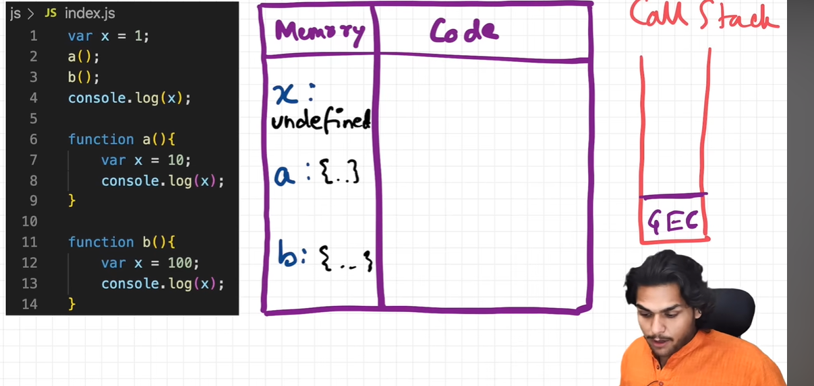
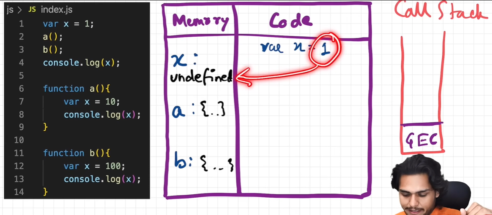
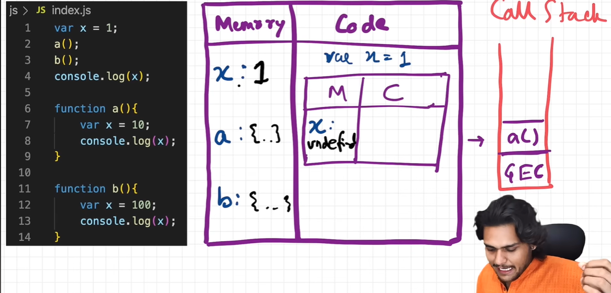
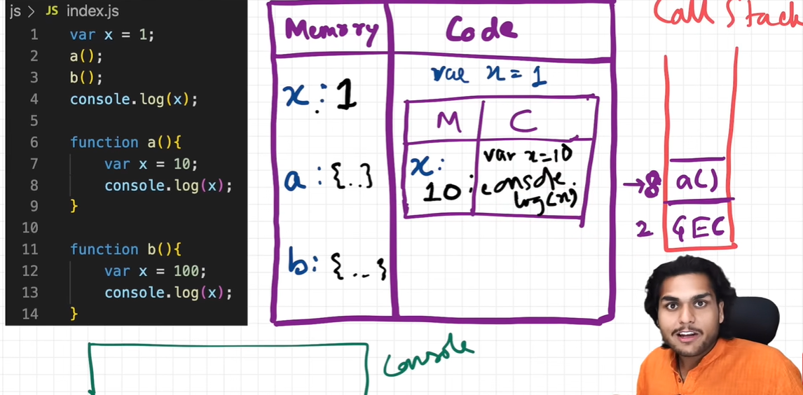

### Episode 04

# How functions work in JS ❤️ & Variable Environment

let's see this code :

```js
1.  var x = 1;
2.  a();
3.  b();
4.  console.log(x)
5.
6.  function a() {
7.    var x = 10;
8.    console.log(x);
9.  }
10.
11. function b() {
12.   var x = 100;
13.   console.log(x);
14. }
```

output :

```js
10;
100;
1;
```

lets understand how the above program execute..

**Remember** whenever JS runs any program a **Global Execution Context (GEC)** created

And it has two components

1. Memory component (First Phase)
2. Code component. (Second Phase)

### 1. Memory Component

In first phase (**Memory creation phase**), memory allocated to variables & functions.

Variable stores underfined and Functions stores the whole code of that fucntion

- variables = undefined
- functions = {...}

#### from above code, we can see

- in `line 1` we have variable `x`
- in `line 6` we have function `a`
- in `line 11` we have function `b`

in first phase,



```js
x = undefined
a = ƒ a() {...}
b = ƒ b() {...}
```

also let's see the **Call Stack**

- intially call stack is empty
- so before JS executing program a Global Execution Context **GEC** created.
- and push to empty Call Stack

Now in second phase which is Code execution phase, let's see what happen...

### 2. Memory Component

Now the actual time come when the code is executed

So when we run the first line `var x = 1;`

- this x = 1 will replace the x = undefined by x = 1.

  

- now the x becomes 1 i.e `x : 1`
  - please note here `x : 1` not representing x ratio 1.
  - remember in first episode we learn that variable stored in a `key : value` pair

### Now the code moves from `line 1` to `line 2`

- `a();`
- here function a is invoke
- so now a brand new **Execution Context (EC)** is created
- Now in Call Stack `a()` is added.
- again this EC contains 2 components (Memory & Code)
- so now this again go into 2 phases i.e Memory Creation phase & Code Execution Phase
- In `function a () {}` we have
  ```js
  6.  function a () {
  7.    var x = 10;
  8.    conole.log(x);
  9.  }
  ```
- ### See carefully here
- notice we have varibale x here too also we have variable x in `line 1`
- `line 7` variable x is limited to its own EC environment so it doesn't affected by `line 1` variable x which is in Global EC environment.
- so here in separate brand new EC, initially `x = undefined`.

  

- after first phase completion of brand new EC it goes into second phase i.e Code Execution phase
- In code execution phase `x = undefined` replaced with `x = 10`

- now in `line 8` x will look for its value in Local Memory space
-When Aksay say Local Memory Space that means it is very much limited to that paricular EC (in our case this is for `function a()` )

  

- now our console will look like this
  ```
  10
  ```
- now we don't have anything to execute in this function `a()` so this EC will be deleted & popped (deleted) from the Call Stack too.

### Now the code moves from `line 2` to `line 11`

- `b();`
- here function b is invoke
- so now a brand new **Execution Context (EC)** is created
- Now in Call Stack `b()` is added.
- again this EC contains 2 components (Memory & Code)
- so now this again go into 2 phases i.e Memory Creation phase & Code Execution Phase
- In `function a () {}` we have
  ```js
  11.  function b () {
  12.    var x = 100;
  13.    conole.log(x);
  14.  }
  ```
- ### See again carefully here
- notice we have varibale x here too also we have variable x in `line 1`
- `line 12` variable x is limited to its own EC environment so it doesn't affected by `line 1` variable x which is in Global EC environment.
- so here in separate brand new EC, initially `x = undefined`.

- after first phase completion of brand new EC it goes into second phase i.e Code Execution phase
- In code execution phase `x = undefined` replaced with `x = 100`

  

- now our console will look like this

  ```
  10
  100
  ```

- now we don't have anything to execute in this function `b()` so this EC will be deleted & popped (deleted) from the Call Stack too.

### now the code moves to `line 4`

- `console.log(x)`
- this x is belongs to Global Execution Context environment
- so it look for the variable x in GEC environment
- in `line 1` it gets it value i.e `x = 1`
- it will print the value of x = 1 in console

- now our console will look like this

  ```
  10
  100
  1
  ```

Finally everything is done executing, Now the Global Execution context will be deleted and popped (removed) from the **Call stack**.

SO that is how the whole program is executed

This was the visual represention of how the programs executing with the help of diagrams.

Now let's see how these things work in the browser

- for better understanding I will highly recommend you to watch this video at time stamp `15:04` [click here](https://youtu.be/gSDncyuGw0s?list=PLlasXeu85E9cQ32gLCvAvr9vNaUccPVNP&t=904)
