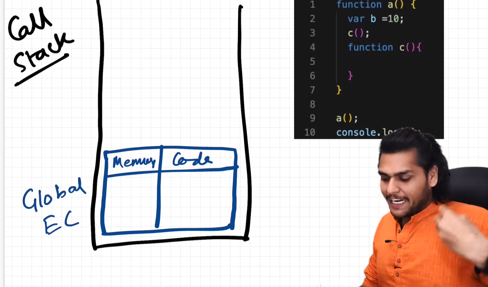
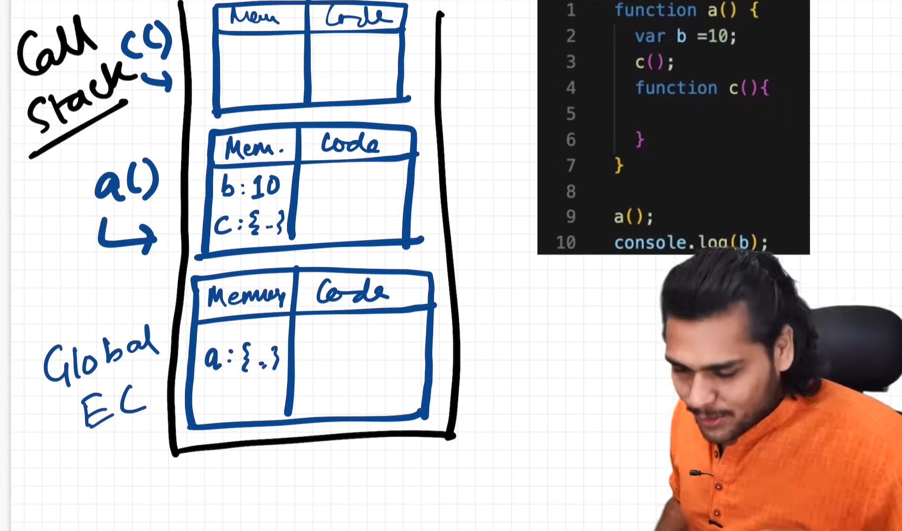

### Episode 07

# The Scope Chain, 🔥Scope & Lexical Environment

> "Scope in JS is directly related to Lexical Environment"

#### Let's run this program :

```js
1.  function a() {
2.    console.log(b);
3.  }
4.
5.  var b = 10;
6.  a();
```

When JS engine moves to line 2 it search for variable `b` in **Local Space** here local space means inside the `function a()`.

But variable `b` is not in the Local Space (i.e in `function a`). Because we didn't created variable `b` inside that function.

So, now what will happened ?? Will it print **undefined** ??

Remember in previous episodes we learnt about a special placeholder in case of **hoisting**. Will it print **undefined** or **not defined** error, like the variable `b` not exist. Or will it directly print the value `10` ?

What will happened ??

When you run this code you will se the follwoing output:

```
10
```

Means, `line 2` access the value of b & log the value of `b` which is created & initialise outsie the local space of `function a`

#### Now let's try this program :

```js
1.  function a() {
2.    c();
3.    function c() {
4.      console.log(b);
5.    }
6.  }
7.
8.  var b = 10;
9.  a();
```

the output will be :

```
10
```

It can again access value `10`.

So that means, even inside the function which is inside another function which is inside the Global Scope We can access variable `b`.

#### What if I do this :

```js
1.  function a() {
2.    var b = 10;
3.    c();
4.    function c() {
5.      console.log(b);
6.    }
7.  }
8.
9.  a();
```

```
10
```

It will again print value `10`.

#### And When I do this ?

```js
1.  function a() {
2.    var b = 10;
3.    c();
4.    function c() {
5.
6.    }
7.  }
8.
9.  a();
10. console.log(b);
```

The output will be :

```
Uncaught ReferenceError: b is not defined
```

You will get `not defined` error.

Here **Scope** comes in picture.

### So What is Scope ?

Scope means where you can access a specific variable or a function in our code.

- Scope = Visibility
- Scope determines the accessibility (visibility) of variables.

JavaScript variables have 3 types of scope:

1. Global scope
2. Function scope
3. Block scope

#### let's again see our code

```js
1.  function a() {
2.    var b = 10;
3.    c();
4.    function c() {
5.
6.    }
7.  }
8.
9.  a();
10. console.log(b);
```

here variable `b` is created & intialise inside the `function a`.

So, it will be only accessible inside the `function a` means it's **scope** will be limited to `function a`.

Outside the `function a` we cannot access that variable i.e variable `b`

But now the question is :

#### Can we access variable b inside the `function c` ? .

let's console log `b` inside `funtion c` and find it.

```js
1.  function a() {
2.    var b = 10;
3.    c();
4.    function c() {
5.      console.log(b);
6.    }
7.  }
8.
9.  a();
```

the output will be :

```
10
```

Here **scope** of variable `b` is `function a`. Means we can also access variable `b` inside the `function c` because `function c` is nested inside the `function a`.

#### Remember :

### "Scope is directly dependent on Lexical Environment."

Let's understand Lexical Environment with visual representation.

When we run this program:

```js
1.  function a() {
2.    var b = 10;
3.    c();
4.    function c() {
5.
6.    }
7.  }
8.
9.  a();
10. console.log(b);
```

- A **Global Execution Context** is created and it is put onto the **Call Stack**

  

- This GEC, has Memory & Code component in it.

- When you run this program, it will try to assign values to **Gloabl variables & functions**. So it will try to assign value to `function a` here. As we know **function** literally store the whole code inside it.

- Now after Memory Creation Phase it goes into Code Execution Phase, in which it will invoke the `function a` here, see in `line 9`

- We know whenever the `function` is inovoke, a new **Execution Context** created.

- The new Execution Context (for `function a`) has 2 parts **(Memory & Code)**.

- Now this `function a` initially reserve memory for variable `a` as `undefined` & `function c` (= whole code inside that funtion) in Memory Creation Phase.

- Now in code execution phase this variable `b` become `10`.

- Now it will move to next line and reach `line 3` here `function c` is invoke. So, new Execution Context will be created.

  

> ### "Whenever Execution Context is created, a Lexical Environment is also created."

- So. "Lexical Environment is the local memory along with the lexical environment of its parent."
- Lexical is a term which means **in hierarchy** or **in a sequence**
- In code term, we can say here `function c` is lexically inside this `function a`. (see above code)
- we can also say `function a` is lexically inside the global scope.
- So, this is known as Lexical.
- So, when you heard Lexical environment, that means **local memory along with the lexical environment of its parent.**

Let's see this code again

```js
1.  function a() {
2.    var b = 10;
3.    c();
4.    function c() {
5.      console.log(b);
6.    }
7.  }
8.
9.  a();
```

- In `line 5` we are printing value of varaible `b`, JS engine initially find value of `b` inside it's local memory space (here it is `function c`). If it doesn't find the value of `b` it will find in it's parent memory space (here it is `function a`).

- Here in `function a`, variable of `b` is present (in `line 2`), so it print the value of variable `b`.

- Suppose if variable `b` is not present in `function a` then JS engine will find the value of variable `b` it will start finding in parents memory space here in this code example it is global space.

- And if it also don't find the value of variable `b` it will then print `Uncaught ReferenceError: b is not defined`

- This is **Scope Chain**, When JS engine does not find anything in the local memory, it goes in its parent, untill id does not find something it will continue to goes to parent spaces ubtill it reach Global memory space, and if it also does not find anything in Global memory space, it will print `not defined`

### from here I will highly recommend to watch video from timestamp = [Click here](https://youtu.be/uH-tVP8MUs8?list=PLlasXeu85E9cQ32gLCvAvr9vNaUccPVNP&t=934)
