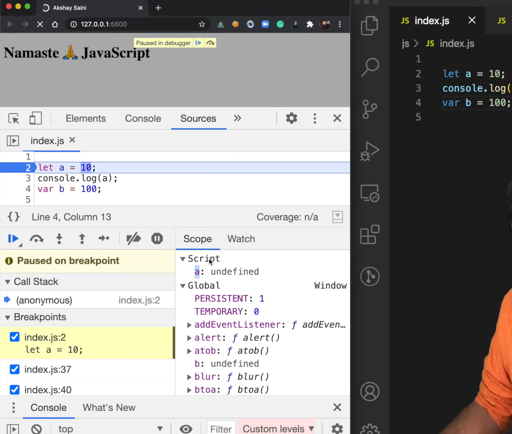
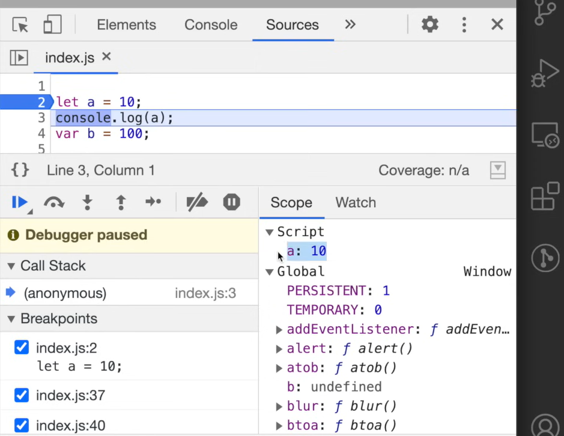

### Episode 08

# let & const in JS 🔥Temporal Dead Zone

```
- "Do you know what is Temporal Dead Zone ?"

- "Are let & const declarations hoisted ?"

- SyntaxError vs ReferenceError vs TypeError ?
```

### Are let & const declarations hoisted ?

Yes, **let** & **const** declarations are Hoisted. But they are hoisted very differently than the **var** declaration.

- wrong statement ❌ = **let** & **const** are not Hoisted.

- correct statement ✅ = **let** & **const** are in **Tempral Dead Zone** for the time being.

#### if you run this code :

```js
console.log(b);
let a = 10;
var b = 100;
```

#### you will get output

```
undefined
```

- we are getting **undefined**, remember it is a special keyword, assign to variable when we try to access variable before initializing it

#### now, wehn we run this code :

```js
console.log(a);
let a = 10;
var b = 100;
```

#### you will get output

```js
Uncaught ReferenceError: Cannot access 'a' before initialization
```

#### here we can observe that in case of **var** we are getting **undefined** but in case of **let** we get `ReferenceError`. Why so ?

### Is it mean **let** are not **Hoisted** ?

- No, it doesn't mean **let** are not Hoisted.
- **let** are in a **Temporal Dead Zone** for the time being.

### How to know **let** variable hoisted or not ?

### Was this **let** variable allocated memory or not ? Will it behave **var** or not ?

Let's see,

```js
1.
2.  let a = 10;
3.  console.log(a);
4.  var b = 100;
```

If we put debugger on `line 1`, even before running a single line of code, you will see in browser dev tools specially in **Scope** field, JS allocated **undefined** to variable `a` (let). and we also have variable `b` (var) whose value is same **undefined**.



It is weird, here we can see JS assign **let** variable in **Script** but in case of **var** variable it assign in **Global** space.

This means **var** variable attach to **Global** object. But in case of **let**, **const** JS engine also allocate memory but in separate memory space not in **Global** space.

And you cannot access this **let** & **const** variable declarations before you put some value in them. So this is what Hoisting in **let**.

Now if you move one step forward with debugger, you will see value **10** assign to variable **let** in a separate memory space other than **global** space here it is **Script**. Now it is ready to be access, if I move to next line i.e `line 3` we can access value **10** in your console.



Here comes the Temporal Dead Zone.

#### What is Temporal Dead Zone ?

- The time since when this **let** variable was hoisted & till it initialise some value, the time between them is known as **Temporal Dead Zone**.

- The phase from Hoisting till it assign or insitialise with some value. That phase is known as Temporal Dead Zone.

- If you try to access **let** or **const** variable before initialisation, you wil get `ReferenceError`.

- Whenever you try to access a varable inside a Temporal Dead Zone, it gives you `ReferenceError`.
  - it would look like this `ReferenceError: Cannot access "a" before initialisation`

- They can only be accessed once some value is initialise to them.

  ```js
  1.  console.log(a);
  2.
  3.  let a = 10;
  4.
  5.  var b = 100;
  ```

  - here anything before `line 3` is the **Temporal Dead Zone** for `a`.

### ReferenceError

- let's access some variable which is not declare inside our code

  ```js
  console.log(x);
  ```

  - it will throw `ReferenceError` error and say `x is not defined`,
  - like this
    ```js
    Uncaught ReferenceError: x is not defined
    ```
  - it means when JS engine tries to find out the value of this variable x in the current scope, it was not able to find it, x was not there so there was no reference , hence it says `ReferenceError x is not defined`

  ```js
  1.  console.log(b);
  2.
  3.  let a = 10;
  4.
  5.  var b = 100;
  ```

  - if you try to access variable b (which is var type) here, it will print **undefined** in console, because memory allocated to `b` but it has not yet initialised yet. So, JS engine will give that special placeholder i.e **undefined**

#### Let's see this code

```js
let a = 10;
console.log(a);
var b = 100;
```

- when you type this in browser console
  ```
  window.b
  ```
- you will get value `100`
- means vaiable **var** `b` is attached to the **window** object i.e (Global Space)
- but if you try to do this

  ```
  window.a
  ```

  - it will print `undefined`, because variable other than **var** is not a part of **window** object. so if you try access variable **let** or **const** in **window** object (or in global space), you will get `undefined`

- by seeing this behaviour we can say variable **let** is little more strict than **var**.
- variable **const** is more stricter than these, it restrict the redeclaration.

#### now, see this code

```js
let a = 10;

let a = 100;
```

- in output you will get `SyntaxError` error

```
Uncaught SyntaxError: Identifier 'a' has already been declared
```

- if you have syntax error in your code, your program will not run & throw `SyntaxError` error.

  ```js
  1.  console.log("hey");
  2.  let a = 10;
  3.
  4.  let a = 100;
  ```

  OR

  ```js
  1.  console.log("hey");
  2.  let a = 10;
  3.
  4.  var a = 100;
  ```

  - above codes wll throw `SyntaxError` error, without printing `line 1`.

  But you can do this

  ```js
  1.  console.log("hey");
  2.  var a = 10;
  3.
  4.  var a = 100;
  ```

  - above code wll run & print `hey` in your console without any error.

  - in case of **var** we can do this. your code will run without throwing error, but it is not a good practice to do this (means declaring the same variable name more than one time)

### Const declaration

- **const** = constant
- very strict
- you cannot reinitialise in **const** variable
- In case of **let** you can do this :

  ```js
  let a;
  a = 10;
  console.log(a);
  ```

  OR

  ```js
  let a = 10;
  a = 20;
  console.log(a);
  ```

- In case of **let** we can reinitialise values. But in case of **const** we cannot, it will throw `SyntaxError`.
- So, if I do this :

  ```js
  const a = 30;
  a = 10;
  console.log(a);
  ```

  - you will get this error
    ```
    Uncaught TypeError: Assignment to constant variable.
    ```

  Also if you do this

  ```js
  const a;
  a = 20;
  console.log(a);
  ```

- you will get this error
  ```
  Uncaught SyntaxError: Missing initializer in const declaration
  ```

### SyntaxError vs ReferenceError vs TypeError ?

- **TypeError** :
  - Assignment to constant variable.
  - if you declare **const** variable & initialise later OR you reinitialise value to **const** variable, it will throw `TypeError.

- **SyntaxError** :
  - when you do wrong coding means code which does not follow JS syntax, its like grammatical error for JS.
  - if you do this :

  ```js
  1.  console.log("hey");
  2.  let a = 10;
  3.
  4.  let a = 100;
  ```

  - it will throw `SyntaxError` because you didn't follow the rule of declaring JS for declaring variables.

- **ReferenceError**
  - When JS engine trues to find out specific variable inside the memory space & it cannot access it, then it gives us `ReferenceError`.

  - If you do this :

  ```js
  console.log(a);
  const a = 10;
  ```

  - it will throw `ReferenceError` because for `line 1` varaible `a` is in **Tempral Dead Zone**.

  - Also we get `ReferenceError` When we try to access variable which we did not declare in our code, in this case we get `ReferenceError : not deined` error.

### So we have let, const & var, we have 3 ways to declare variable. What should we use ?

Akshay recommend :

- **const**
  - You first priority should be **const** whenever you want to put some value which is not change later, when you don't have to assign anything else to the same variable, use **const**.
  - **const** is stricter so, you won't run into unexpected errors.

- **let**
  - When you don't use **const**, use **let** because **let** has a **Temporal Dead Zone** & you will not run into unexpected errors like `undefined`.

- **var**
  - Keep **var** aside, don't use it.
  - There is some cases, you might want to use **var** but use it very consciously.

**Important Note**

- Sometimes Temporal Dead Zone, messer your life as a developer, it leads to unexpected errors. So the best way to avoid this is to always put your **declaration & initialisation** on the top of the scope. So that as soon as your code starts running, it hits the intialisation part at the first then you go into the logic & you can do something with these variables. Otherwise, you can run into Unexpected Error in JS.
  - we can say by putting **declaration & initialisation** on the top, we are shrinking the **Temporal Dead Zone** window to zero, which reduce the chances of running into unexpected errors.
