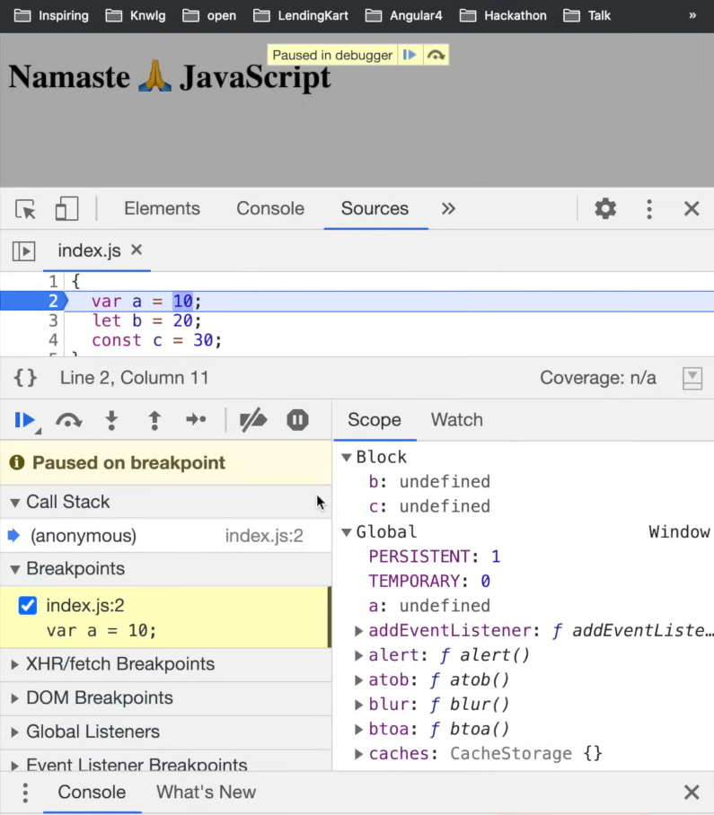
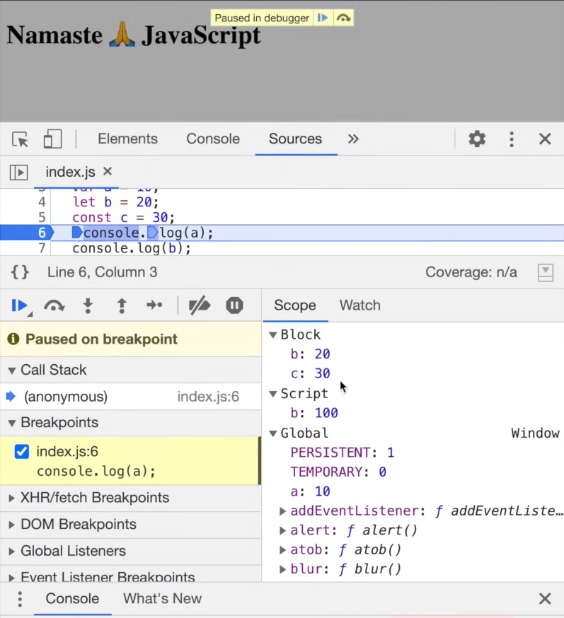

### Episode 09

# BLOCK SCOPE & Shadowing in JS 🔥

### What is Block in JS ?

- Block is defined by curly braces i.e `{}`

  ```js
  {
  }
  ```

  - this is a perfectly valid JS code & its not doing anything. But why we use this block.

- Block is also known as **Compound Statement**.
  - Block is used to combine multiple JS into one group, just like this :
  ```js
  {
    // Compound Statement
    var a = 10;
    console.og(a);
  }
  ```
- #### Why do we need to group all these statements together ?
  - we group multiple statements together in a block so that we can use it where JS expect one statement.
  - for example, let's see this code

    ```js
    if(true)
    ```

    - it will throw Syntax error in console like this

      ```
      Uncaught SyntaxError: Unexpected end of input
      ```

    - here JS expect one statement after `if(true)`
    - this one statement can be anything just like

      ```js
      if (true) true;
      ```

    - so this is peerfectly valid statement in JS. But if you want to write multiple statements you can only do that by grouping them together.
    - And for grouping we use block `{}`.
    - Like this :

      ```js
      if (true) {
        var a = 10;
        console.log(a);
      }
      ```

  - So this group of multiple statements caan be used in a place where JS expects a single statement. So, if it expects a single statement her after `if(true)`, but we want to use multiple statements so we use **Block**.

  ```js
  if (true) console.log("hey");
  ```

  - this is perfectly valid code, here we use only one statement so we don't need to put **Block**. like this
    ```js
    if (true) {
      console.log("hey");
    }
    ```
  - In short, for executing multiple statements we use **Block**.

### What is Block Scope in JS ?

- Block scope means what all variable and functions we can access inside the block.
- To understand this, let declare 3 types of variables and see how thry behave inside the block, How Hoisting works inside the block, and how things works behind the scene.

```js
1.  {
2.    var a = 10; // var present in Global space (Global object).
3.    let b = 20; // let is not a part of Global space.
4.    const c = 30; // const is also not a part of Global space.
5.  }
```

- put debugger in first line in browser & run the code, you will see

  

- here you can see variable `b` & `c` are in the **block scope**. This is a separate space where variable `b` & `c` are `hoisted` and assigned `undefined`, remember from the hositing episode this are Hoisted in a separate memory space that is reserved for this **block**.

- And in case of `var a` it is hoisted in `Gloabl space` and this let & const are in `Block scope`, This is where that statement comes into picture - **"let & const are block scope"**

- And when JS finished this JS code, whe it goes to line 5, this varaiblee `let & const` are no longer accessible. You cannot access this `let` & `const` outside this `{}` block, that is known as **"let & const are in block scope"** whereas you can access this `var` even outside the block becasue it is in the `Global scope`

- So, if you run this code :

```js
{
  var a = 10;
  let b = 20;
  const c = 30;
  console.log(a); // this will print value of a i.e 10
  console.log(b); // this will print value of b i.e 20
  console.log(c); // this will print value of c i.e 30
}
console.log(a); // this will print value of a i.e 10 (because var is part of Global scope)
console.log(b); // this will throw error -> ReferenceError i.e b is not defined
console.log(c);
```

- you will get this output :

```
10
20
30
10
Uncaught ReferenceError: b is not defined
```

### What is Shadowing in JS ?

- let's see this code

```js
var a = 10;
{
  var a = 50; // <--- this will shadow the above var a = 10 into a = 50.

  console.log(a); // now this will print 50
}
console.log(a); // now this will print 50 because shadowed in above block
```

- you will get this output :

```
50
50
```

- let's see this code

```js
1.  let b = 100; // <- variable "let" is not a part of Global space
2.
3.  {
4.    let b = 20; // <- this will be only accessible to this block, we can't access this outside this block scope.
5.    console.log(b); // <- this will print 20
6.  }
7.  console.log(b); // <- this will print 100
```

- you will get this output :

```
20
100
```

- if you debug in browser console you will see this

  
  - here we can see in Scope field, we have `Block`, `Script` & `Global` space

### What is Illegal Shadowing in JS ?

consider this code :

```js
let a = 20;
{
  var a = 10;
}
```

- this above code is illegal shadowing, you can't reassign same **let** variable with **var** inside **block**. showing output --> `Uncaught SyntaxError: Identifier 'a' has already been declared`

- But you can do this :

```js
let a = 20;
{
  let a = 10;
}
```

- you can reassign same **let** variable with **let** inside **block**

- also we can do this

```js
var a = 20;
{
  let a = 10;
}
```

- this above code is perfectly valid shadowing.

- now see this code :

```js
let a = 20;
function x() {
  var a = 10;
}
```

- this above code is valid, because **var** is in it's boundary, here it is `functional scope`

- now see this code :

```js
const a = 20;
{
  const a = 10;
}
```

- this above code is perfectly valid, because const is in its memory space

**NOTE :**

- Block scope also follows **Lexical** Scope.
  - consider this code :

  ```js
  const a = 20;
  {
    const a = 100;
    {
      const a = 200;
      console.log(a); // this will print 200
    }
    console.log(a); // this will print 100
  }
  console.log(a); // this will print 20
  ```

  - this above code will print `200`, because of lexical scope, console search a in its nearest scope, if it don't find it will search for it in it's parent scope, and so on.

- Whether you declare a function with **function** keyword or an **arrow function** we feel that those might have different scope but they are exactly same. Thus, all the scope rules which work on **normal function** are exactly same in the **arrow function**
