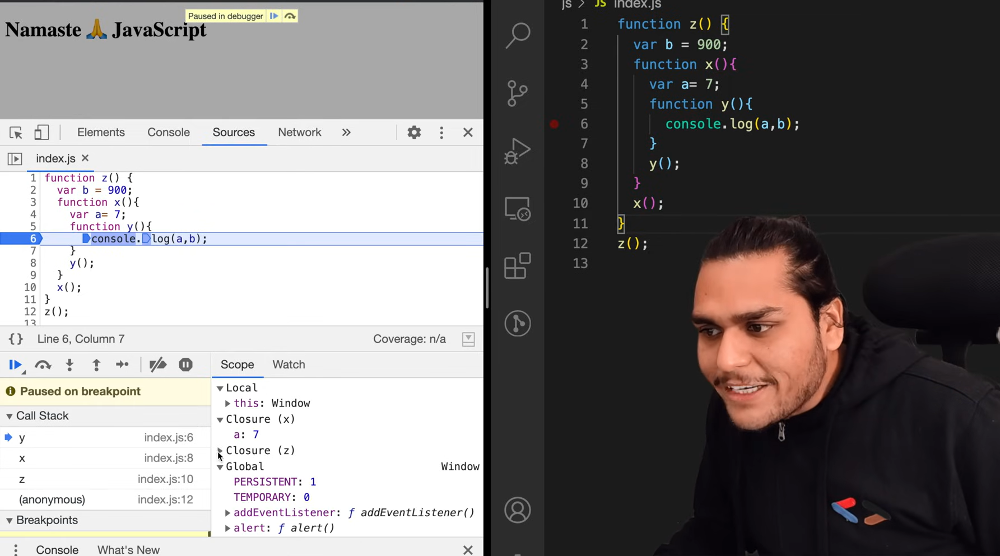

### Episode 10

# Closures in JS 🔥

#### Before closures let see how functions are different in JS as compare to other programming languages:

- In JS, you can do this

  ```js
  function x() {
    var a = function y() {
      console.log("Hi");
    };

    a();
  }

  x();
  ```

  - we can assign function directly to the variable. But we can't do this in other program. lang.

- Also we can pass function as an argument, like this :

  ```js
  function x(g) {

    g();
  }

  x(function y() {
    console.log("hi);
  });
  ```

- Also we can return function, like this

  ```js
  function x() {
    var a = 7;
    function y() {
      console.log(a);
    }

    return y;
  }
  var z = x();
  console.log(z);
  ```

#### let's understand what closure is with this code :

```js
function x() {
  var a = 7;
  function y() {
    console.log(a);
  }
  y();
}

x();
```

**Output**

```
7
```

- as we understand about the **Lexical Scope** in previous episodes.

- We know `console.log(a)` inside the `function y` will look for variable `a` inside it's own function (i.e `function y`) to print its value. But there is no variable `a` present. So, it will look for it in it's parent scope (here in `function x`). In `function x` variable `a = 7` present, so `console.log(a)` will fetch the value from `function x` scope which is parent function of `function y`.

- This is **CLOSURE**.

### Closure

- A function bind together with lexical scope forms a **Closure**.
- A closure is the combination of a function bundled together (enclosed) with references to its surrounding state (the lexical environment)
- In other words, a closure gives a function access to its outer scope.

#### Let's see this code :

```js
1.  function x() {
2.    var a = 7;
3.    function y() {
4.      console.log(a);
5.    }
6.
7.    return y;
8.  }
9.  var z = x();
10. console.log(z);
```

**Output** :

```js
ƒ y() {
    console.log(a);
  }
```

- Here if we see the above code, after some time **Execution Context** of `function x` will delete from **CALL STACK** along with it's variables and functions.

- But here we are assigining `functin x` in `line 9` in variable `z`, and when we print `z` we see above output.

- Now if we add this code in above code

  ```js
  z();
  ```

- our final code will look like this :

```js
1.  function x() {
2.    var a = 7;
3.    function y() {
4.      console.log(a);
5.    }
6.
7.    return y;
8.  }
9.  var z = x();
10. console.log(z);
11. z();
```

- we will get this Output :

```js
ƒ y() {
    console.log(a);
  }
7
```

- here we can see, value `7` is printed from `line 2`. But as we know Execution Context is deleted for `function x` along with it's variables & functions inside it after it done executing. Here comes **Closures** into picture.

- Functions akshay said, are so beautiful that when they are returned from another function, they still maintains their lexical scope, they remember where they were actually present. So, Though `x` no longer exist nothing is there, but still this `function y` remebers its lexical scope where it came from.

- It came from here `line 2 - line 5`, it remembers that there was something known as variable `a` and it has the binding strong there.

- In simple words, when we `return y` in `function x`, not just the `function y` code was return but a **Closure world** was returned. That Closure was enclosed function along with lexical scope. That was returned.

- So not just the function was returned, the closure along with functions & it's lexical scope was returned. And it was put inside variable `z`. So when we execute (or invoke) `z` somewhere else in your program, it stills remember the reference to `a` and it tries to find variable `a` and print it.

- So in interview, not just say **Function return a function and this and that.... and what not**. Just say **Functions along with lexical scope bundled together forms a closure**. That was closure is, also explain with this above example.

##### Some cool developer also write the above code like this :

```js
1.  function x() {
2.    var a = 7;
3.    return function y() { // directly return function y here
4.      console.log(a);
5.    }
6.  }
7.
8.  var z = x();
9. console.log(z);
10. z();
```

#### Corner cases of Closures

##### Example 1 :

```js
1.  function x() {
2.    var a = 7;
3.    function y() {
4.      console.log(a);
5.    }
6.    a = 100;
7.    return y;
8.  }
9.  var z = x();
10. console.log(z);
11. z();
```

- we will get this Output :

```js
ƒ y() {
    console.log(a);
  }
100
```

- some people think why we get value of `a` is `100` instead of `7`.
- We get `100`, because reference is changed, variable `a` is reference to `7` before but we assign new value `a = 100`, which changed the reference from `7` to `100`.

##### Example 2 :

- adding one more parent function to the code, like this :

```js
1.  function z() {
2.    var b = 900;
3.    function x() {
4.      var a = 7;
5.      function y() {
6.        console.log(a, b);
7.      }
8.      y();
9.    }
10.   x();
11. }
12. z();
```

- here in `line 6` we are trying to access `function y` parent's scope and it's parent's prarent's scope also. Will it still be a **Closure** ??

- Let's see in browser :

  

- here we can see in Scope, we have Closure for `function x` also with `function z`.

**Output**

```
7 900
```

#### Uses of Closures:

- Module Design Pattern
- Currying
- Functions like once
- memoize
- maintaining state in async world
- setTimeouts
- Iterators
- and many more...
