### Episode 15

# Asynchronous JavaScript & EVENT LOOP from scratch 🔥

> #### JavaScript is a synchronous single-threaded language. It has one Call Stack and it can only do one thing at a time.

consider this code :

```js
1.  function a() {
2.    console.log("a");
3.  }
4.  a();
5.  console.log("End");
```

- When we run this program, JS create a "Global Execution Context" (GEC). In which two phase or component will be created :
  1. **Memory Creation Phase** (Variable Environment)
  2. **Code Execution Phase** (Thread of Execution)

- In memory creation phase, initially `undefined` will be assigned to variables. And for the function, literally the whole code inside that function will be stored.

- In code execution phase, code start executing.

- So if we see our above code, When JS start runing the program, first it will create a "Call Stack" and put the GEC inside it.
- In memory creation phase, JS skims through all the code, and assign value for function `a` literally the whole function, the whole code inside that function will be stored. i.e
  ```js
  f a() {
    console.log("a")
  }
  ```
- Now in code execution phase, JS starts executing the code, so in our code when it start from `line 1`, there is nothing much to execute from `line 1 to 3`. When JS reach `line 4` here function `a` is called. So JS will put this function `a` in "Call Stack".

- Now our Call Stack will look like this :

    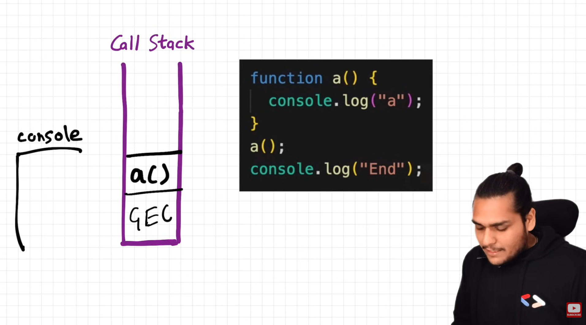

- Now for function `a` another Execution Context will be created and two phase will occur their too, and when the function `a` done executing and complete its work, it will be deleted or popped out from the "Call StacK".

- Now GEC only exist in the Call Stack.
- When JS reach `line 5` and done executing, after that GEC will also be deleted from the Call Stack, and now Call Stack is empty. And our program is finished.

- So the main job of this Call Stack is to execute whatever comes inside it. That's all it does. It does not wait for anything. If you give anything it just quickly executes that.

That is why developer says:

> "Time, Tide, and JavaScript wait for none."

### But what if we need to wait for something ?

**Ques:** What if have a program or a script which needs to be run after 5 seconds ? Can we do that ??

**And:** NO, we cannot do that. Because whatever comes inside the Call Stack is automatically quickly executed.

- if you give it a script and say that, execute this after 5 seconds later. It cannot do that. Because it does not have a timer. (Call Stack does not have a timer)

So suppose if we want to run some script after certain delay, we will need some extra super power. that super power of timer.

Let see how we can get this super power

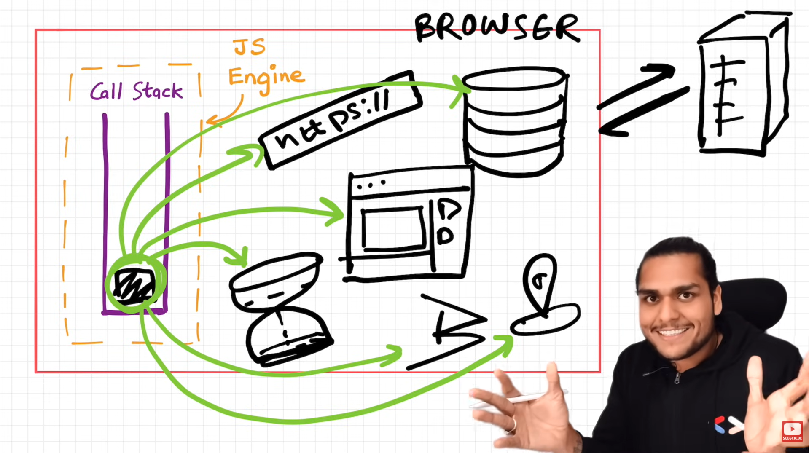

- Call Stack exist in JS Engine.
- JS Engine exist in Browser (denoted by red line).

So, this Browser has JS Enginer in it. And JS Engine has Call Stack in it. And in Call Stack our program runs.

- This is the actual place where JS code executes.

So, the Browser is one of the most remarkable creation in the history of mankind, it is said by Akshay because :

- we can store data in Browser (in `localStorage`)
- we have a timer in the Browser
- we also have URL from where we access movies, websites, etc.
- we can interact with external world through Browser (for example accessing Netflix server)
- we can access Bluetooth, Geolocation, etc in Browser.
- we can do alot in Browser.

If we need to access these super powers, we need to have that kind of a connection. This JS Engine needs some way to access these superpowers.

#### To access those superpowers we need `Web APIs`.

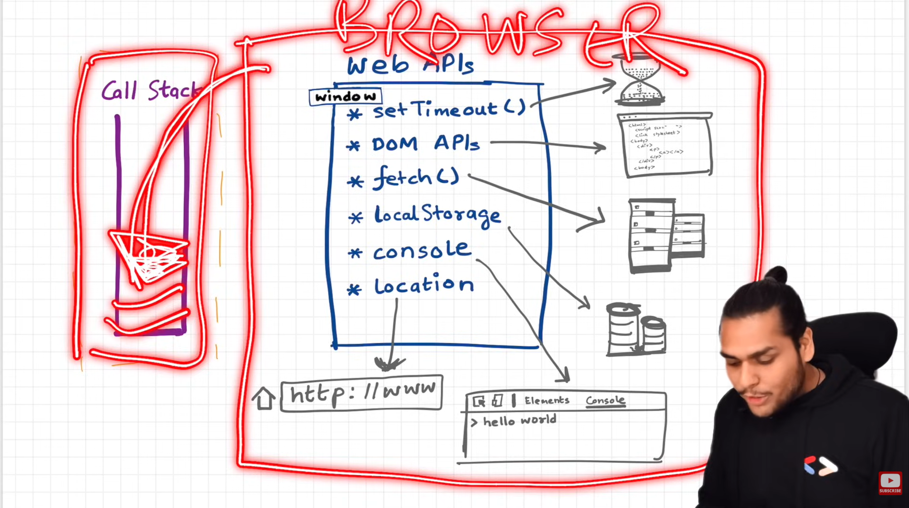

- One thing to note here, these Web API's are not part of the JavaScript. Many developers don't know about this.

- There are more a lot superpower exist which is not shown in the above image.

- Now you can ask, when we write the code we don't write `window.setTimeout()` but we write just `setTimeout()`. So, because `window` is the global object and this `setTimeout` is present in the global object or the global scope, you can access this without the keyword `window`.

- if you do `window.setTimeout()` or just `setTimeout`. Both are the same thing.

- So the browser wrap these superpower APIs into the global object i.e `window`. And give access of this "window" to the Call Stack or may be the JS Engine.

- And now you can access those APIs without using `window` keyword

### Let's see the example

```js
console.log("Start");

setTimeout(function cb() {
  console.log("Callback");
}, 5000);

console.log("End");
```

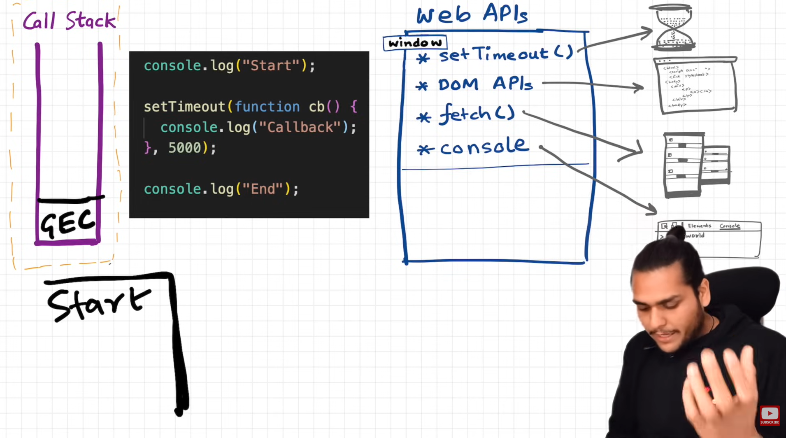

- GEC will be created. and line one will print - **Start** in the console

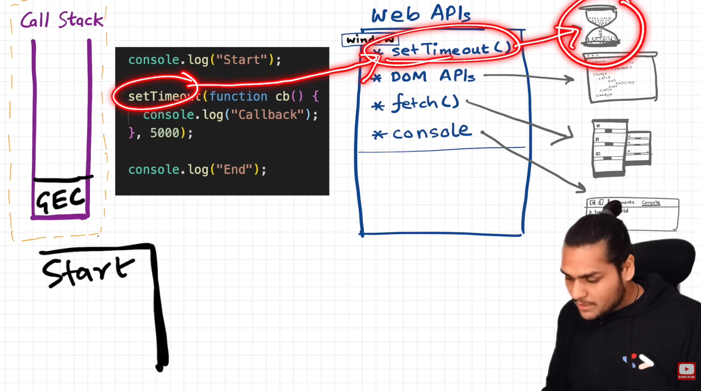

- **setTimeout()** is a web API which will attach timer of 5000ms = 5 seconds.

- And the callback function inside setTimeout() will be registered in Web API environment for later use (which is after 5 seconds).

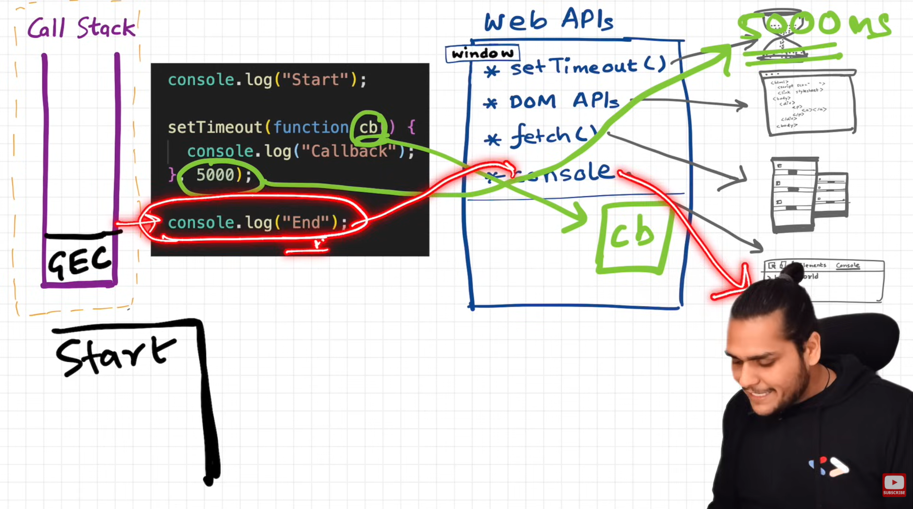
  
  - JS will not wait for the timer to finsihed, and goes to next line and print - **End** in the console. 
 
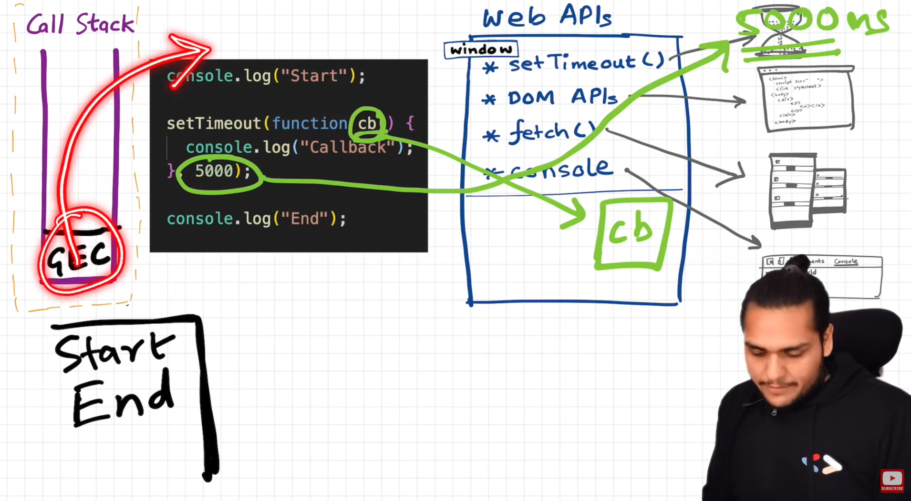
  
  - The GEC popped out or deleted from the Call Stack after executing each and every line of this code.
  - And meanwhile all these happening this timer is still running. 
  - As soon as this timer expires (5 seconds passed.). This call back function which was registered needs to be executed now. 
  
  - And because we know all code executed in the Call Stack, we somehow need this callback function (i.e `cb`) move inside the Call Stack.

- If after 5 seconds, we get this callback function somehow inside the Call Stack. The Call Stack job is to quickly execute whatever comes inside it.

- so, Now **EVENT LOOP** and **Callback Queue** comes in the picture.

So here we have Event Loop and Callback Queue :

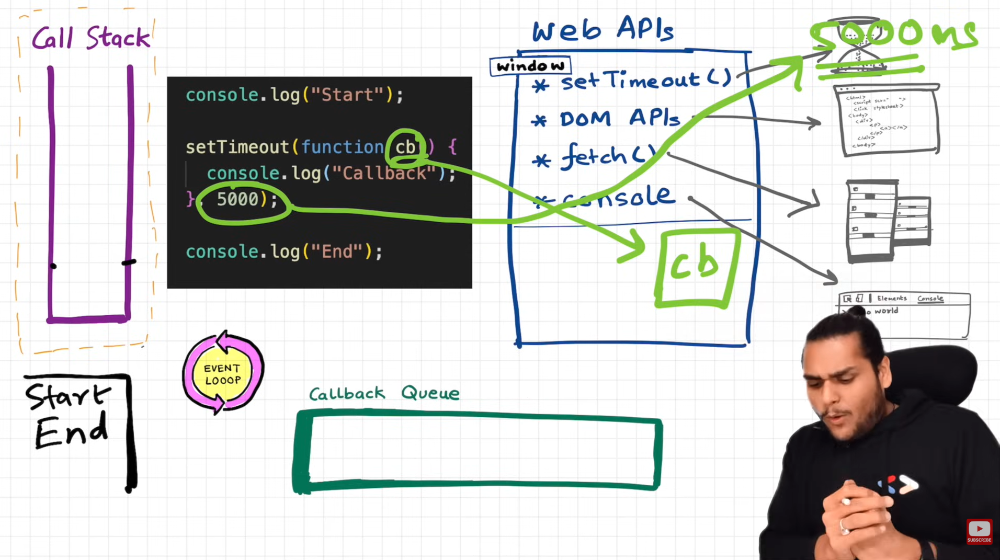

### As soon as the timer expires, this `cb` needs to go inside the "Call Stack". But it cannot directly go into the call stack.

Then how does it go to the call stack ??

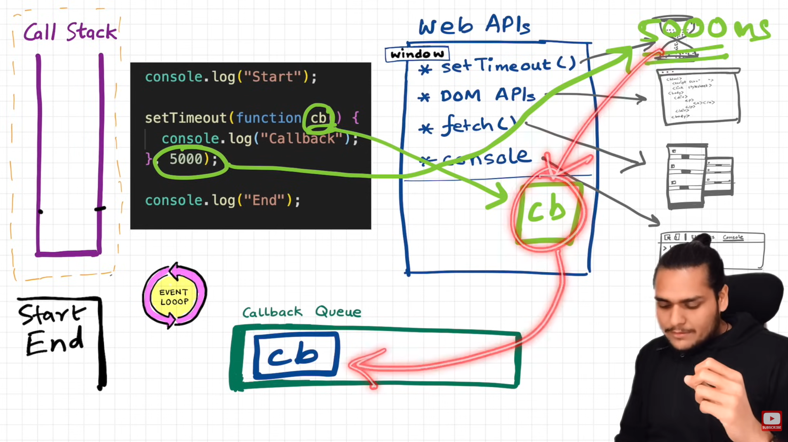

### It goes to the call stack through this "Callback Queue".

- So when the timer expires this `cb` function is put inside this Calback Queue. And the "Event Loop" present there. The job of this Event Loop is to check this Callback Queue & put this `cb` function into the Call Stack. "Event Loop" act as a gatekeeper here.

- And the Call Stack quickly execute this `cb` function. How ?? -> It creates an Execution Context for the function `cb` and do the same drill as we learned previously."Callback" text will be printed in the console. And after done executing it also popped out or deleted from the Call Stack.

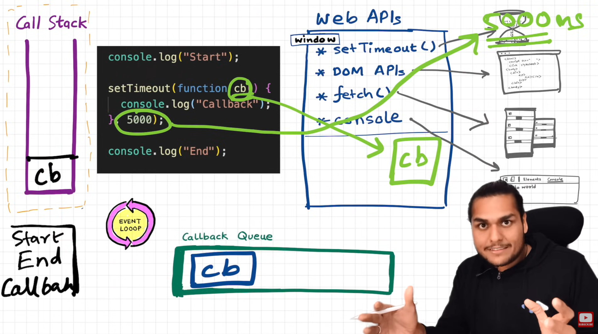

This is how this whole thing works.

## Let's take one more example :

```js
1. console.log("Start");
2.
3. document.getElementById("btn").addEventListener("click", function cb() {
4.  console.log("Callback");
5. });
6.
7. console.log("End");
```

- `document.getElementById` is the part of the Web APIs (`DOM APIs`).
- `console` is also a part of Web APIs.
- `addEventListener` is also a part of Web APIs.

In above code, When JS run this program, it skims thorugh the whole code and assign values to variables and function as we learned this before like 2 phases are created "Memory Creation Phase" & "Code Execution phase" and all...

Initially, Global Execution move inside the Call Stack.

When JS reach `line-1` in code execution phase, it see `console.log("Start");` so it will print **Start** in the console. and moves to the next line. In `line-3` we have the code which performs asynchronous task (task which will perform later) so it will move to the `line-7` where it see `console.log("End");` so it will print **End** in the console.

```js
3. document.getElementById("btn").addEventListener("click", function cb() {
4.  console.log("Callback");
5. });
```

so this code is waiting for user to click on the button which has the id=`btn`. When the user clicked on it, the callback funtion `cb` move to the `Callback Queue` --> `Event Loop` --> `Call Stack`. Then Call Stack quickly execute the `cb` function inside which we have `console.log("Callback");` which will print **Callback** inside the console.

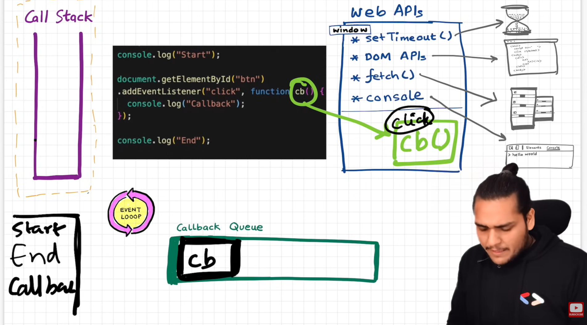

Note:

**Event Loop** :

- has one job
- it continuously monitors the `Call Stack` & `Callback Queue`.
- if the Call Stack gets empty and the Event loop sees if there function present in the Callback Queue waiting to be executed, Event loop just take this function and move it to the Call Stack. And Call Stack quickly execute it.
- When Event loop pick the function from Callback Queue, that function will be removed from there. and after executing inside the Call Stack it also be popped out from it.

### Why do we need Callback Queue

Suppose if the user clicked the Button continuously 5 times, so the `cb` will be added in the Callback Queue. So there will be 5 `cb` in the Callback Queue waiting to be executed.

Event Loop put the 5 `cb` one by one in the call stack. And Slowly slowly the `cb` will be popped out from the Callback Queue

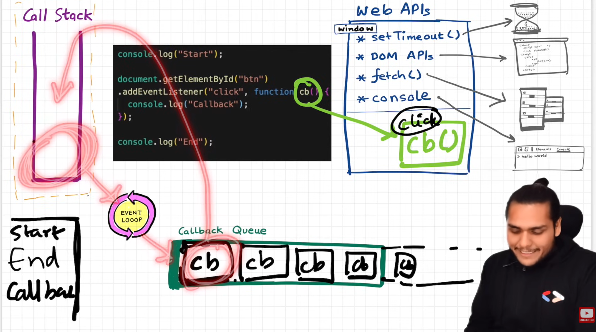

### we have seen the setTimeout(), addEventListener, DOM APIs. Now let's see how fetch() works.

Fetch works differently from other Web APIs. Let's see:

**fetch()**: used to call API.

```js
console.log("Start");

setTimeout(function cbT() {
  console.log("CB SetTimeout");
}, 5000);

fetch("https://api.netflix.com").then(function cbF() {
  console.log("CB Netflix");
});

console.log("End");
```

Here we have setTimeout() as well as fetch() function.

**what is fetch() :**

- fetch() is a Web API, used to make network calls.
- fetch() basically goes and request a API call.
- fetch() function returns a Promise.
- In above code, the callback function inside the fetch() will be executed once this Promise is resolved.
- We haven't learned about Promise yet, so when we say Promise here it means that when we get our data or response from the API, then just execute the callback function which is present inside the fetch().

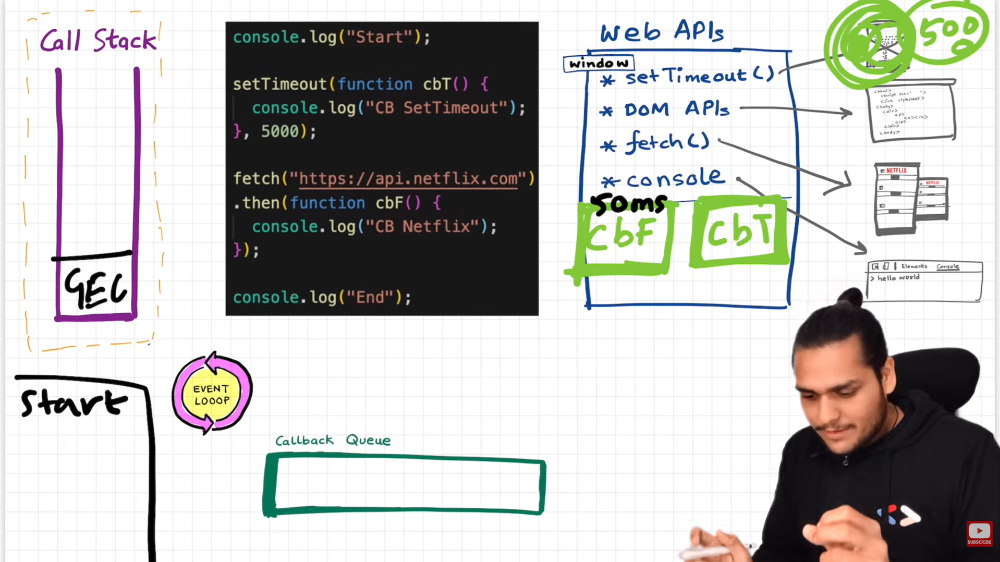

When the program start running, Global Execution Context created. When the JS see the first line of the above code i.e `console.log("Start");` - it print **Start** in the console.

After that it goes to next line where JS see:

```
setTimeout(function cbT() {
  console.log("CB SetTimeout");
}, 5000);
```

then it set the timer of 5 seconds in the browser. The callback function `cbT` inside it will be registered in the Web API environment to be executed later after 5 seconds completed.

JS will not wait for setTimeout to finished and moves to the next line which is :

```
fetch("https://api.netflix.com")
  .then(function cbF() {
    console.log("CB Netflix");
  });
```

here we are calling fetch() function which is responsible for network call. It will fetch data or response from the Netflix API (i.e `https://api.netflix.com"`). The callback function `cbF` will be registered in the Web APIs environent. Response from the Netflix API can be come fast or late depending on the network.

Let's say we recieve the response from the Netflix API in 50ms which is faster than 5000ms of setTimout(). Means we get the response from Netflix API before the setTimeout timer expires.

So the question here is **Will it (fetch() code) will move to the Callback Queue before setTimeout() ?**

> The answer is NO.

No this will not happen. Now the most confusing part will come which a lot of developers don't understand. i.e **The Micro task Queue**

**Micro task Queue** is like a Callback Queue but has a higher priority. Whatever the function comes inside this Micro task Queue will be executed first. And the function inside the Callback Queue will be executed later.

Now what comes inside the Micro task Queue ? Yes, you guessed it right. `cbF` function (part of fetch which return Promise) which done its work before the setTimeout.

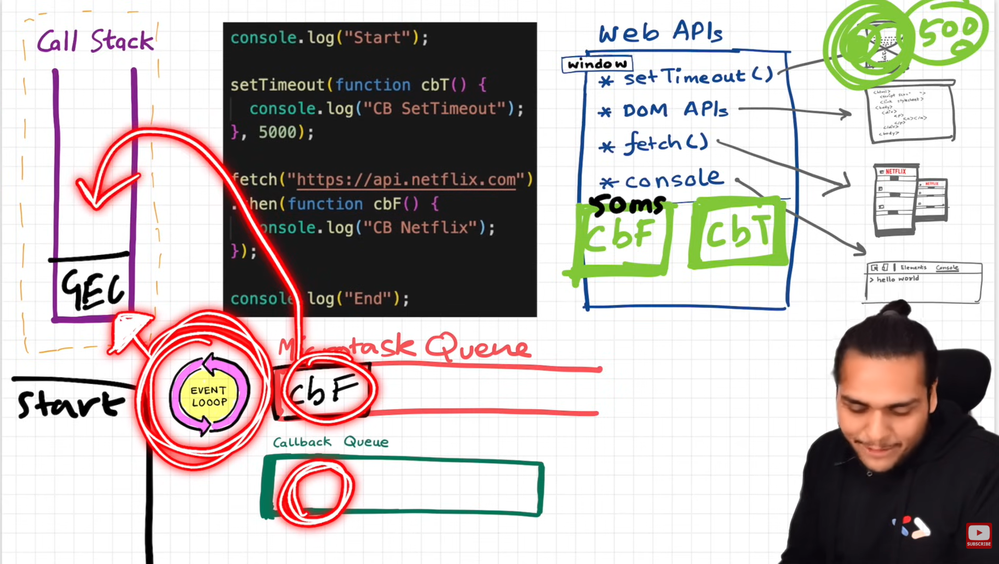

The job of the Event Loop is to check is Call Stack is empty. And When the Call Stack is empty it gives the chance to the fucntions present in the Queue to go inside the Call Stack.

So we are not done yet executing our code, we were still executing the fetch() code. But we already got the response from the Netflix server within the 50ms

Suppose we have 100 millions line of code before `console.log("End");`. And JS takes it time to execute these lines in the main thread (call stack). But we already have this callback `cbF` function waiting here in the Queue to be executed. But JS running these 100 million line of code.

Let's see when `cbF` callback function get the chance to get executed in the call stack. Meanwhile these 100 million line of code, the timer of setTimout expires. It the JS which is doing one thing at a time, but not browsers. The Browser doing a lot of things in the background that is why we called it before a "Superpower".

When the timer of 5000ms expires, `cbT` callback function ready to be executed and goes to the Callback Queue.

While the 100 million line of code executing, these callback functions `cbF` and `cbT` are waiting to be moved into the Call Stack. Event Loop is takes this responsibility to move them in the Call stack as soon as the Call stack will get empty.

After JS executed the 100 million line of code and reach the last line `console.log("End");`. So **End** will be printed in the console. Now there is nothing to be executed in the call stack the GEC will be popped out to the call stack.

The Event Loop is monitoring the Call stack, once the call stack is now empty it also sees the some tasks are waiting in the Queue. As we know "Micro task Queue" has the higher priority than "Callback Queue". So Event Loop take the `cbF` callback function and put it inside the Call Stack.

Now, the `cbF` comes inside the Call Stack so it will be executed and print **CB Netflix** inside the console. After executing, it will be popped out from the Call Stack.

Now, the Event Loop see in the Queue, where `cbT` callback function present. So it will take it and put it inside the Call Stack. `cbT` will be executed and print **CB SetTimeout** in the console. After executing it will also popped out from the Call Stack.

Now Event Loop again doing it's job by looking in the Queue, but this time there is nothing. Now everything is done executing. Now the complete program is finished.

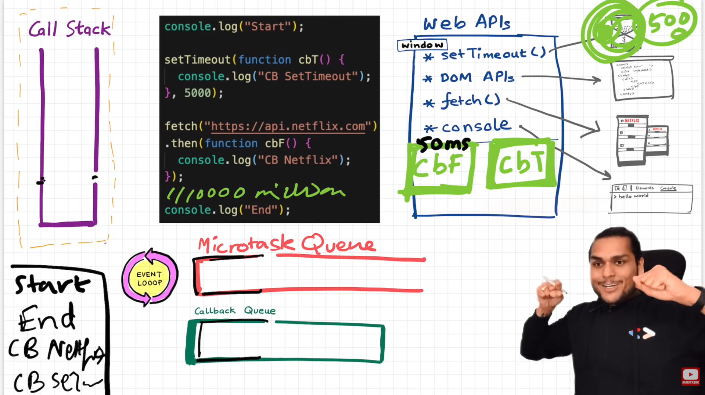

#### There is something here to note :

- There are two things about which "Micro task Queue" care about
  1. Promises
  2. Mutation Observer

- What if we have 3 functions inside the "Micro taks Queue", which create more micro task queue inside it When Call back queue get a chance to execute ? As we know Micro taks Queue has the higher priority than Callback Queue. So the Callback queue feel the starvation, This process or phenonmena is known as **Starvation of the Callback Queue**.

### Here are some questions asked by a viewer on the video:

Q) When does the event loop actually start ? Are only asynchronous web api callbacks are registered in web api environment ? Does the web api environment stores only the callback function and pushes the same callback to queue/microtask queue? How does it matter if we delay for setTimeout would be 0ms. Then callback will move to queue without any wait ?

_Askhay reply_:

#### 1. When does the event loop actually start?

- Event loop, as the name suggests, is a single-thread, loop that is `almost infinite`. It's always running and doing its job. ❤️

#### 2. Are only asynchronous web API callbacks are registered in the web API environment?

- YES, the synchronous callback functions like what we pass inside map, filter, and reduce aren't registered in the Web API environment. It's just those async callback functions that go through all this.

#### 3. Does the web API environment stores only the callback function and pushes the same callback to queue/microtask queue?

  - Yes, the callback functions are stored, and a reference is scheduled in the queues. Moreover, in the case of event listeners(for example click handlers), the original callbacks stay in the web API environment forever, that's why it's advised to explicitly remove the listeners when not in use so that the garbage collector does its job.

#### 4. How does it matter if we delay for setTimeout would be 0ms. Then callback will move to queue without any wait?

- No, there are trust issues with setTimeout() 😅. The callback function needs to wait until the Call Stack is empty. So the 0 ms callback might have to wait for 100ms also if the stack is busy. It's a very beautiful concept, and I've covered this in detail in the next episode of Namaste JavaScript. 🔥
